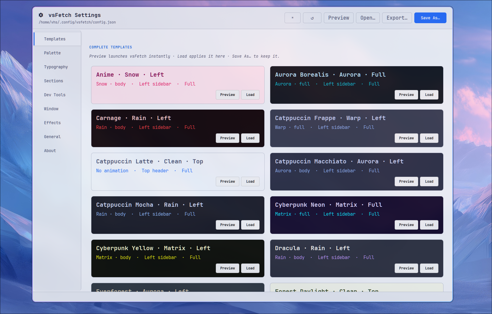
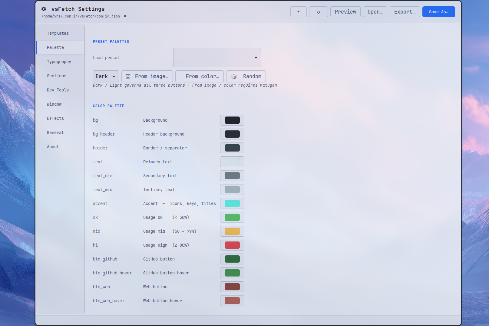
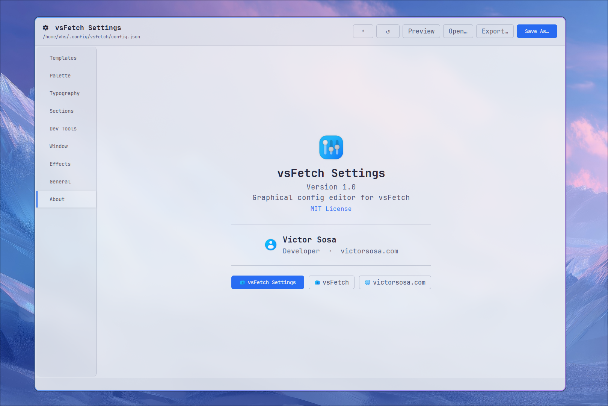

# vsFetch Settings

A graphical config editor for [vsFetch](https://github.com/victorsosaMx/vsFetch) — built with Python 3 + GTK3.
Edit every setting visually, preview the result live, and export themes without ever touching a JSON file.

[](https://aur.archlinux.org/packages/vsfetch-settings)
[](LICENSE)





---

## Features

- **Templates** — 21 built-in themes shown as live-colored cards; load any one instantly
- **Selective merge** — loading a template preserves your personal settings (background image, sections order, dev tools, chassis, extends path)
- **Palette editor** — 14 color pickers with role labels; generate palettes from an image, a base color, or at random
- **Palette generation** — Dark / Light dropdown governs all three generation modes (image, color, random); no repeated dialogs
- **Typography** — font family + 3 size sliders (title, body, small)
- **Sections** — reorder and toggle which sections vsFetch shows
- **Dev Tools** — add, remove, and reorder the tools shown in the Development section
- **Window** — width and height for full / mini modes
- **Effects** — animation type, scope, color, opacity, speed, particle count; gradient bar; background image
- **General** — layout (top / left), default mode, chassis override
- **Export theme** — pick exactly which keys to include; downloads a ready-to-use theme JSON
- **Live preview** — launches vsFetch with your current (unsaved) settings in a temporary config
- **Dirty tracking** — unsaved-changes indicator (●) in the title bar; confirm dialog before discarding
- **Keyboard shortcuts** — `Ctrl+S` save · `Ctrl+O` open · `Ctrl+R` reset
- **Dark / Light editor UI** — toggle in the header bar
- **Single executable** — one Python script, no build step

---

## Requirements

- Python 3
- GTK3 (`python-gobject`)
- `python-cairo`
- [vsFetch](https://github.com/victorsosaMx/vsFetch) (for live preview)
- [matugen](https://github.com/InioX/matugen) *(optional — palette generation from image / color)*

### Arch Linux

```bash
sudo pacman -S python-gobject python-cairo
```

---

## Install

### Arch Linux — AUR

```bash
yay -S vsfetch-settings
```

### Manual

```bash
git clone https://github.com/victorsosaMx/vsFetch-Settings.git
cd vsFetch-Settings
chmod +x vsfetch-settings
cp vsfetch-settings ~/.local/bin/vsfetch-settings
```

---

## Usage

```bash
vsfetch-settings
```

Edits `~/.config/vsfetch/config.json`. Creates it with built-in defaults if it doesn't exist yet.

### Palette generation

| Mode | Requires |
|------|----------|
| 🖼 From image… | matugen |
| 🎨 From color… | matugen |
| 🎲 Random | nothing |

Select **Dark** or **Light** in the dropdown once — all three buttons use that setting.

### Export theme

Click **Export…** in the header bar, check the keys you want to share, and save a self-contained theme JSON. Others can load it with:

```bash
vsfetch --config /path/to/theme.json
```

or activate it permanently via `extends` in their `config.json`.

---

## Keyboard shortcuts

| Shortcut | Action |
|----------|--------|
| `Ctrl+S` | Save |
| `Ctrl+O` | Open config file |
| `Ctrl+R` | Reset to defaults |

---

## Credits

- **[vsFetch](https://github.com/victorsosaMx/vsFetch)** — the app this editor configures
- **[matugen](https://github.com/InioX/matugen)** — Material Design 3 palette extraction
- **[Catppuccin](https://github.com/catppuccin/catppuccin)** — default editor palette

---

## License

MIT — see [LICENSE](LICENSE) for details.

---

## Author

**Víctor Sosa**
🌐 [victorsosa.com](https://victorsosa.com/)
🐙 [github.com/victorsosaMx](https://github.com/victorsosaMx)
